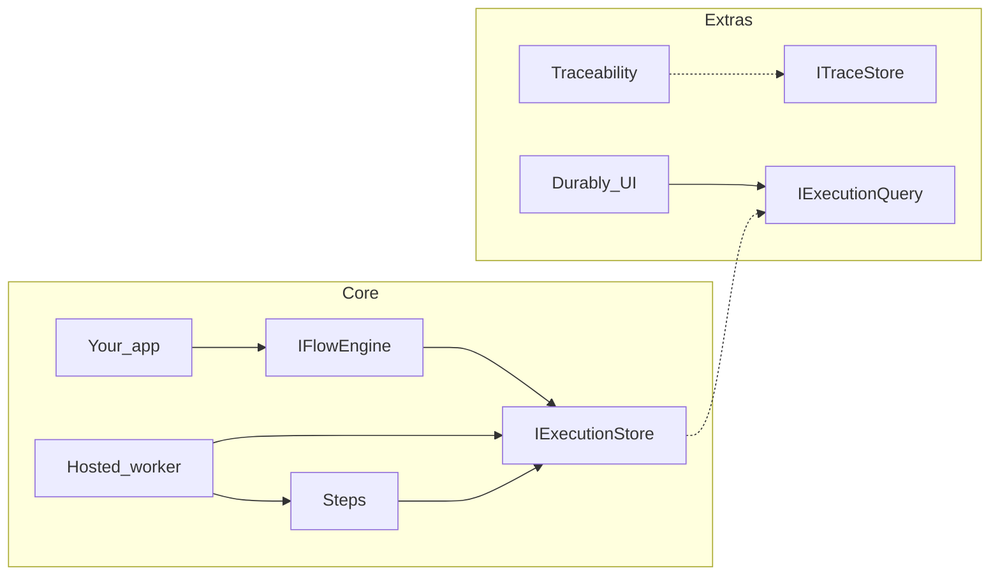
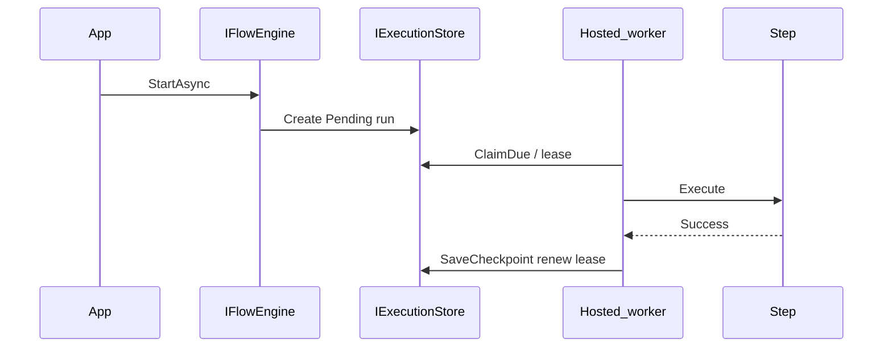

<p align="center">
  
</p>

<h1 align="center">Durably</h1>

<p align="center">
  <strong>Durable workflows for .NET.</strong><br />
  Checkpointed steps, crash-safe resume, and optional monitoring in your app.
</p>

<p align="center">
  <a href="https://github.com/mohd2sh/Durably/actions/workflows/ci-unit.yml"></a>
  <a href="https://github.com/mohd2sh/Durably/actions/workflows/ci-integration.yml"></a>
  <a href="https://github.com/mohd2sh/Durably/actions/workflows/ci-e2e.yml"></a>
  <a href="https://www.nuget.org/packages/Durably.Core"></a>
  <a href="https://www.nuget.org/packages/Durably.Core"></a>
  
  
</p>

## Why Durably

Durably is a simple .NET library for durable workflow execution inside your app.

You define workflows as ordinary C# steps (`Flow.For` or `IFlow` / `IStep`). Branch like a state machine with `StepIf` and `Choose`. Durably gives you robust, durable execution out of the box. Progress is checkpointed in your store. A hosted worker claims work with leases and resumes from the last completed step after a crash.

Not every workflow is a chain of events across services. Often a single service owns the whole flow and must run those steps as one durable unit: atomic in intent, robust under failure, and safe to continue without repeating finished work.

Add Traceability when you want step-level monitoring. Add the UI when you want a dashboard to search executions and inspect runs. Keep the core when you only need the engine.

Durable workflows in your service. Your store. Your process.

## Core features

| Feature | What you get |
| --- | --- |
| Durable checkpoints | State is saved after each successful step |
| Resume after crash | Worker reclaim with leases skips completed work |
| Retries | `RetryPolicy.None` / `Fixed` / `Exponential` per step or as a default. Filter with `RetryOn` / `DoNotRetryOn` |
| Step timeouts | Per step or `DurablyOptions.DefaultStepTimeout` |
| Branching | `StepIf` and `Choose` / `When` / `Otherwise` |
| Terminal hooks | `OnSuccess` / `OnFailure` plus DI success and failure handlers |
| Hosted worker | `AddDurably` registers a background worker. Tune with `ConfigureWorker` |
| Instance and run ids | Business `InstanceId` plus system `RunId`. Open-run policy via `OpenConflictPolicy` |
| Persistence | InMemory (`UseInMemoryStore`). SQL Server, PostgreSQL, SQLite via EF Core or Dapper |
| DI | Fluent registration and `AddFlowsFromAssembly` |

## Extra features

| Feature | Package | What you get |
| --- | --- | --- |
| Traceability | `Durably.Traceability` | Async step traces (best effort). Does not block checkpoints |
| Dashboard | `Durably.UI` | Embeddable ASP.NET Core UI to search and inspect executions (net6 through net10) |

## Where it fits

| When you want | A strong fit |
| --- | --- |
| Durable multi-step workflows (and state-machine style branching) inside a .NET service, with optional monitoring and UI | **Durably** |
| Durable work inside each microservice, with that service owning its own store and worker | **Durably** |
| Cross-service messaging and broker sagas | MassTransit, NServiceBus |
| Managed cloud or platform-scale orchestration | Durable Functions, Temporal |
| Visual or BPM-style workflow authoring | Elsa and similar tools |

Durably fits a monolith or a microservice. Use it when one service owns a multi-step workflow and needs durable, resumable execution. In a microservice architecture each service can run its own flows, worker, and store. Use a message bus when the coordination itself must cross service boundaries with events.

## How it works

| Term | Meaning |
| --- | --- |
| Flow | Ordered steps over typed state |
| Step | Unit of work (`IStep<TState>` or a lambda) with optional retry and timeout |
| State | Your POCO. Serialized at each checkpoint |
| Checkpoint | Durable save after a successful step via `IExecutionStore` |
| InstanceId | Caller-chosen business key (for example `order-100`) |
| RunId | System-generated id for one execution attempt |
| Lease | `LockedBy` / `LockedUntil` so one runner owns an instance |
| Recovery | Expired or due leases are claimed again. Completed steps are skipped |
| Retry policy | Per step or `DurablyOptions.DefaultRetry` |
| Persistence | `IExecutionStore` for execution. Query interfaces power the UI |

### InstanceId and RunId

| Concept | Role |
| --- | --- |
| InstanceId | Stable business key you pass to `StartAsync` |
| RunId | One attempt. New Guid when a start creates a run |

At most one open run (`Pending` or `Running`) exists per flow name and InstanceId. When prior runs are only terminal, the same InstanceId can start again. Each attempt keeps its own checkpoints and traces.

`StartAsync` returns `FlowStartResult`:

| Outcome | Meaning |
| --- | --- |
| `Created` | A new `Pending` run was inserted |
| `Conflict` | An open run already exists (`OpenConflictPolicy.Fail`, the default) |
| `Skipped` | An open run already exists (`OpenConflictPolicy.Skip`). The existing `RunId` is returned |

```csharp
var result = await engine.StartAsync(flow, instanceId: "order-100", state, new FlowStartOptions
{
    OpenConflict = OpenConflictPolicy.Skip,
    Metadata = new Dictionary<string, string> { ["orderId"] = "order-100" }
});

if (result.WasCreated)
{
    // New run enqueued. Worker will claim it.
}

var latest = await engine.GetStatusAsync(flow.Name, "order-100");
var specific = await engine.GetStatusAsync(flow.Name, "order-100", result.RunId);
```

### Why it is robust

1. `StartAsync` inserts a `Pending` run with a new `RunId` and signals the worker.
2. The worker claims due rows with `ClaimDue`. Ownership is stamped as `LockedBy` and `LockedUntil` using skip-locked style claiming so runners do not race the same row.
3. The processor runs pending steps. After each success it checkpoints state and renews the lease.
4. If the process crashes or the lease expires, another runner can reclaim the work. Completed steps are skipped.
5. On terminal success or failure the lease is released. Hard failures can move into a poison quarantine path so one bad execution does not stall the queue.





## Packages

Each library publishes as its own NuGet package. Host apps with EF Core or the UI target **.NET 6 through .NET 10**. Core libraries also ship `netstandard2.0` for broader library reuse.

### Core packages

| Package | Role |
| --- | --- |
| `Durably.Abstractions` | Contracts (`IFlowEngine`, `IExecutionStore`, builder surfaces) |
| `Durably.Core` | Engine, fluent `Flow.For` |
| `Durably.Extensions.DependencyInjection` | `AddDurably`, flow registration, hosted worker |
| `Durably.Persistence.InMemory` | In-process store (`UseInMemoryStore`) for tests and demos |
| `Durably.Persistence.EntityFrameworkCore` | EF Core store (`UseSqlServer` / `UsePostgres` / `UseSqlite`), net6 through net10 |
| `Durably.Persistence.Dapper` | Dapper store (`UseSqlServer` / `UsePostgreSql` / `UseSqlite`) |

### Extra packages

| Package | Role |
| --- | --- |
| `Durably.Traceability` | `AddTraceability` channel sink and writer |
| `Durably.UI` | `AddDurablyUI` / `MapDurablyUI` dashboard, net6 through net10 |

Typical app: Core + Extensions.DependencyInjection + one persistence package. Add Traceability and UI when you want them.

## Installation

**ASP.NET Core + EF Core (SQL Server)**

```bash
dotnet add package Durably.Extensions.DependencyInjection
dotnet add package Durably.Persistence.EntityFrameworkCore
dotnet add package Durably.Traceability
dotnet add package Durably.UI
```

**Worker + EF Core (PostgreSQL)**

```bash
dotnet add package Durably.Extensions.DependencyInjection
dotnet add package Durably.Persistence.EntityFrameworkCore
dotnet add package Durably.Traceability
```

**Tests / demos (in-memory)**

```bash
dotnet add package Durably.Extensions.DependencyInjection
dotnet add package Durably.Persistence.InMemory
```

`AddDurably()` does not register a store. Call `UseInMemoryStore()` (or an EF/Dapper provider) explicitly.

**Dapper (no EF)**

```bash
dotnet add package Durably.Extensions.DependencyInjection
dotnet add package Durably.Persistence.Dapper
```

Then use `UseSqlServer`, `UsePostgreSql` (alias `UsePostgres`), or `UseSqlite` on the Durably builder.

## Quick start

Define state and a fluent flow.

```csharp
public sealed class OrderFinalizeState
{
    public string OrderId { get; set; } = "";
    public string CustomerEmail { get; set; } = "";
}

var flow = Flow.For<OrderFinalizeState>()
    .Step<GenerateReportStep>()
    .Step<SendEmailStep>()
    .Step<FinalizeOrderStep>();
```

Register Durably with a store and start instances. The hosted worker processes them.

```csharp
var builder = Host.CreateApplicationBuilder(args);

builder.Services
    .AddTransient<GenerateReportStep>()
    .AddTransient<SendEmailStep>()
    .AddTransient<FinalizeOrderStep>();

builder.Services
    .AddDurably()
    .UsePostgres(connectionString, o => o.AutoMigrate = true)
    .AddFlow(flow)
    .AddTraceability(t => t.FlushInterval = TimeSpan.FromSeconds(1));

var host = builder.Build();
var engine = host.Services.GetRequiredService<IFlowEngine>();

var start = await engine.StartAsync(flow, instanceId: "order-100", new OrderFinalizeState
{
    OrderId = "order-100",
    CustomerEmail = "buyer@example.com"
});

var status = await engine.GetStatusAsync(flow.Name, "order-100");
```

`StartAsync` enqueues work. It does not run every step on the calling thread. The worker claims due executions with a lease and checkpoints after each step.

## Usage patterns

### Fluent flow in a worker host

See [`samples/Sample.Worker`](samples/Sample.Worker).

```csharp
var orderFinalizeFlow = Flow.For<OrderFinalizeState>()
    .Step<GenerateReportStep>()
    .Step<SendEmailStep>()
    .Step<FinalizeOrderStep>();

builder.Services
    .AddDurably()
    .UsePostgres(connectionString, o => o.AutoMigrate = true)
    .AddFlow(orderFinalizeFlow)
    .AddTraceability(t => t.FlushInterval = TimeSpan.FromSeconds(1));
```

Enqueue with `IFlowEngine.StartAsync(flow, orderId, state)`.

### OOP flows and assembly scan

See [`samples/Sample.AspNetCore.Api`](samples/Sample.AspNetCore.Api).

```csharp
public sealed class OrderFulfillmentFlow : IFlow<OrderFulfillmentState>
{
    public void Build(IFlowBuilder<OrderFulfillmentState> builder) => builder
        .Step<ValidateOrderStep>()
        .StepIf<FraudCheckStep>(s => s.Order.Total >= 500m)
        .Choose(s => s.Order.Channel)
            .When("express", b => b.Step<ReserveExpressStep>())
            .When("standard", b => b.Step<ReserveStandardStep>())
            .Otherwise(b => b.Step<FulfillDigitalStep>())
        .EndChoose()
        .Step<MarkFulfilledStep>()
        .OnSuccess(s => s.CompletionNote = "fulfilled")
        .OnFailure((s, ex) => s.FailureNote = ex?.Message);
}

builder.Services
    .AddDurably(o =>
    {
        o.DefaultRetry = RetryPolicy.Exponential(
            5,
            TimeSpan.FromMilliseconds(100),
            TimeSpan.FromSeconds(5));
    })
    .UseSqlServer(connectionString, o => o.AutoMigrate = true)
    .AddTraceability(t => t.FlushInterval = TimeSpan.FromSeconds(1))
    .AddFlowsFromAssembly(typeof(Program).Assembly);
```

### ASP.NET Core controller

```csharp
var start = await _engine.StartAsync<OrderFinalizeFlow, OrderFinalizeState>(
    id,
    state,
    new FlowStartOptions
    {
        Metadata = new Dictionary<string, string>
        {
            ["orderId"] = id,
            ["customerEmail"] = order.CustomerEmail
        }
    },
    cancellationToken);

var status = await _engine.GetStatusAsync<OrderFinalizeFlow>(id, cancellationToken);
```

### In-memory for tests

```csharp
services.AddDurably().UseInMemoryStore();
```

Requires the `Durably.Persistence.InMemory` package.

## Durably.Traceability

Step traces record outcome, duration, and optional input/output JSON. Writing is asynchronous through a bounded channel. Checkpoints stay durable and synchronous. Traces are best effort and must not block the engine.

```csharp
builder.Services
    .AddDurably()
    .UseSqlServer(connectionString, o => o.AutoMigrate = true)
    .AddTraceability(o =>
    {
        o.CaptureInputOutput = true;
        o.CaptureExceptions = true;
        o.FlushInterval = TimeSpan.FromSeconds(1);
    });
```

EF Core, Dapper, and `UseInMemoryStore` register `ITraceStore`. Call a persistence provider before `AddTraceability()`.

## Durably.UI

Embeddable Angular dashboard and JSON API for searching executions, inspecting an instance, and viewing step traces.

```csharp
builder.Services.AddDurablyUI();

var app = builder.Build();
app.MapDurablyUI("/durable");
```

Default route prefix is `/durable`. The map is anonymous by default. Chain `RequireAuthorization()` when the host already wires ASP.NET Core auth. `DurablyUIOptions.AllowActions` is reserved for future UI actions such as manual resume. Persistence must expose `IExecutionQuery` and `ITraceQuery` (EF Core, Dapper, or in-memory adapters).

<p align="center">
  
</p>

<p align="center">
  
</p>

Full sample: [`samples/Sample.AspNetCore.Api`](samples/Sample.AspNetCore.Api) (Aspire host available under [`samples/Sample.AspNetCore.AppHost`](samples/Sample.AspNetCore.AppHost)).

## Persistence

Supported today:

| Store | EF Core | Dapper | Notes |
| --- | --- | --- | --- |
| InMemory | n/a | n/a | `UseInMemoryStore` (`Durably.Persistence.InMemory`) |
| SQL Server | `UseSqlServer` | `UseSqlServer` | Aspire sample API uses EF + `AutoMigrate` |
| PostgreSQL | `UsePostgres` | `UsePostgreSql` (`UsePostgres` alias) | Aspire sample Worker uses EF + `AutoMigrate` |
| SQLite | `UseSqlite` | `UseSqlite` | Useful for local and tests |

## Advanced

**Terminal hooks.** `OnSuccess` and `OnFailure` run when the flow completes or fails. Register `IFlowSuccessHandler<TState>` / `IFlowFailureHandler<TState>` for DI-based handlers. Use them for notes, metrics, or cleanup you own.

**Metadata.** Pass `FlowStartOptions.Metadata` on `StartAsync` so executions are searchable from the UI and query APIs.

**Worker options.** Defaults are `PollInterval` 2 seconds, `BatchSize` 16, `LeaseDuration` 30 seconds, `MaxDegreeOfParallelism` 4, and `Enabled` true. Override when you need different throughput.

```csharp
.AddDurably()
.ConfigureWorker(o =>
{
    o.Enabled = true;
    o.PollInterval = TimeSpan.FromSeconds(2);
    o.BatchSize = 16;
    o.LeaseDuration = TimeSpan.FromSeconds(30);
    o.MaxDegreeOfParallelism = 4;
    o.RunnerId = "api-1";
})
```

**Multiple runners.** Several hosts can share one store. Leases prevent two runners from owning the same instance at once. Claiming uses skip-locked style semantics so workers pull distinct due rows.

**Dapper without EF.** Use `Durably.Persistence.Dapper` when you do not want an EF dependency.

## Best practices

1. Keep steps small and focused on one side effect.
2. Make steps idempotent. A reclaim after a crash can retry a step that already performed external work once without a durable checkpoint.
3. Retry only transient faults. Prefer `RetryOn` / `DoNotRetryOn` when you need filters.
4. Set timeouts on steps that call external I/O.
5. Put search fields in `FlowStartOptions.Metadata` instead of stuffing large blobs into state.
6. Prefer stable flow names (marker types with `Flow.For<TFlow, TState>()` or `IFlow<TState>` type names).
7. When inserting, removing, or reordering steps on a live flow, do not edit that flow name in place. Ship a new flow name, keep the old registration until non-terminal rows drain, then switch `StartAsync` call sites. Append-only and body-only edits are safe.
8. Turn on Traceability and the UI in non-production first so you can inspect failures quickly.
9. Use `OnFailure` for alerting or recording failure context. Do not treat hooks as a reverse-step transaction model.

## Roadmap

* [ ] NoSQL and document store providers behind `IExecutionStore` (store-agnostic persistence beyond the current SQL providers)
* [ ] Retention and data cleanup (configurable retention period for completed and failed executions, automated cleanup)
* [ ] Wait / continue APIs such as builder `WaitFor`, and engine helpers like `ContinueOrCreate` / `ResumeOrStart`, for flows that need another call to continue or that merge parallel mid-flow work (saga-style waits on more than one event)
* [ ] More builder features for richer control flow beyond `Step` / `StepIf` / `Choose`
* [ ] UI auth support in the Banana Cake Pop / Hot Chocolate spirit: the dashboard lets the operator pick an auth method (Bearer, Basic, OAuth-style fields) and supply client credentials or token settings, while the host configures ASP.NET Core authentication and authorization on the backend
* [ ] UI actions (manual resume) behind `DurablyUIOptions.AllowActions`
* [ ] Publish CI that builds the Angular ClientApp before packing `Durably.UI`
* [ ] Broader docs site (tutorials, API reference)

## Samples

API workflows are split by authoring style under [`Workflows/Oop`](samples/Sample.AspNetCore.Api/Workflows/Oop) (`IFlow`/`IStep`) and [`Workflows/Fluent`](samples/Sample.AspNetCore.Api/Workflows/Fluent) (`Flow.For` + lambdas). Prefer Aspire (Docker) for durable SQL. Standalone defaults to InMemory.

| Sample | What it shows |
| --- | --- |
| [`samples/Sample.AspNetCore.Api`](samples/Sample.AspNetCore.Api) | .NET 10. Oop + Fluent workflow folders. Traceability + UI. InMemory or Aspire SQL Server |
| [`samples/Sample.AspNetCore.AppHost`](samples/Sample.AspNetCore.AppHost) | .NET 10 Aspire 13 host: SQL Server (API) + PostgreSQL (Worker) |
| [`samples/Sample.Worker`](samples/Sample.Worker) | .NET 10. Fluent `Flow.For` + `IStep`. InMemory or Aspire PostgreSQL |

Catalog and curls: [`samples/README.md`](samples/README.md).

## Contributing

1. Clone the repo and restore the solution.
2. For backend work without rebuilding the Angular SPA:

   ```bash
   dotnet build Durably.sln -c Release -p:SkipAngularBuild=true
   ```

3. Unit tests:

   ```bash
   dotnet test tests/Durably.Core.UnitTests
   dotnet test tests/Durably.Extensions.DependencyInjection.UnitTests
   dotnet test tests/Durably.Persistence.EntityFrameworkCore.UnitTests
   ```

   Default CI uses [`Durably.CI.slnf`](Durably.CI.slnf) (excludes load tests). Run large-backlog load separately (10k drain / 10k multi-worker):

   ```bash
   dotnet test tests/Durably.Load.Tests
   ```

   Behavior scenarios (poison quarantine, host reclaim, cross-host latency, small dual-worker) live under `tests/Durably.E2E.Tests`.

4. UI ClientApp changes need Node.js and npm under `src/Durably.UI/ClientApp`.
5. Keep PRs focused. Match existing naming and analyzer settings under `src/` and `tests/`.

## Community

* [Issues](https://github.com/mohd2sh/Durably/issues) for bugs and feature requests
* [Discussions](https://github.com/mohd2sh/Durably/discussions) for questions

## License

MIT. See [LICENSE](LICENSE).
