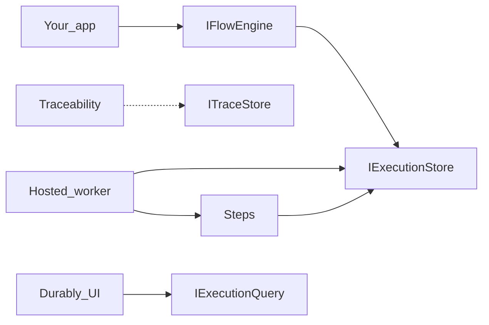
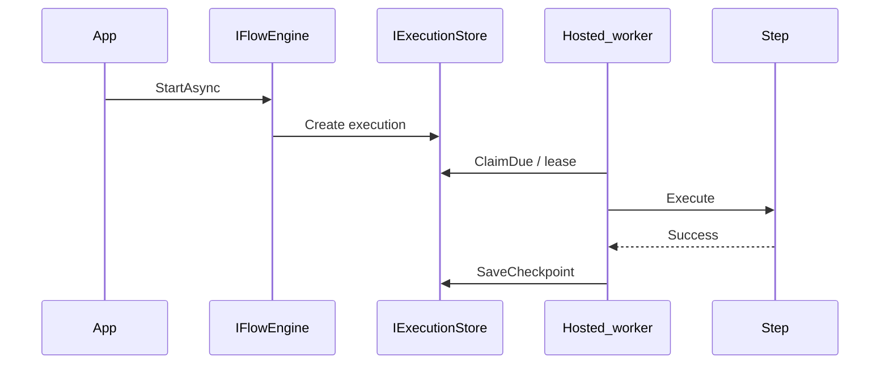

<p align="center">
  
</p>

<h1 align="center">Durably</h1>

<p align="center">
  <strong>Durable execution for everyday .NET code.</strong><br />
  Checkpoint your steps. Resume after any crash.
</p>

<p align="center">
  <a href="https://github.com/durably/durably/actions"></a>
  <a href="https://www.nuget.org/packages/Durably.Core"></a>
  <a href="https://www.nuget.org/packages/Durably.Core"></a>
  
  
</p>

## Why Durably

Many workflows live inside one service. Finalize an order. Fulfill a shipment. Send a notification chain. You should not need a message broker or a separate orchestration cluster for that.

Durably lets you write those flows as ordinary C# steps. The engine persists execution state in your database. A hosted worker claims work with leases. After a process crash it resumes from the last completed step. Steps that already succeeded do not run again.

If you already use MassTransit or NServiceBus for messaging you can still use Durably for same-service workflows. Durably is not a message bus. It is not Temporal or Durable Functions. It is durable execution in your process against your SQL store.

## Features

| Feature | What you get |
| --- | --- |
| Durable checkpoints | State is saved after each successful step |
| Resume after crash | Worker reclaim with leases skips completed work |
| Retries | `RetryPolicy.None` / `Fixed` / `Exponential` per step or as a default |
| Step timeouts | Per step or `DurablyOptions.DefaultStepTimeout` |
| Branching | `StepIf` and `Choose` / `When` / `Otherwise` |
| Terminal hooks | `OnSuccess` / `OnFailure` plus DI success and failure handlers |
| Hosted worker | `AddDurably` registers a background worker. Tune with `ConfigureWorker` |
| Persistence | InMemory (`UseInMemoryStore`). SQL Server, PostgreSQL, SQLite via EF Core or Dapper |
| Traceability | Optional async step traces (best effort, does not block checkpoints) |
| Dashboard | Optional ASP.NET Core UI to search and inspect executions |
| DI | Fluent registration and `AddFlowsFromAssembly` |

## Packages

Each library publishes as its own NuGet package.

| Package | Role |
| --- | --- |
| `Durably.Abstractions` | Contracts (`IFlowEngine`, `IExecutionStore`, builder surfaces) |
| `Durably.Core` | Engine, fluent `Flow.For` |
| `Durably.Extensions.DependencyInjection` | `AddDurably`, flow registration, hosted worker |
| `Durably.Persistence.InMemory` | In-process store (`UseInMemoryStore`) for tests/demos |
| `Durably.Persistence.EntityFrameworkCore` | EF Core store (`UseSqlServer` / `UsePostgres` / `UseSqlite`) |
| `Durably.Persistence.Dapper` | Dapper store (`UseSqlServer` / `UsePostgreSql` / `UseSqlite`) |
| `Durably.Traceability` | `AddTraceability` channel sink and writer |
| `Durably.UI` | `AddDurablyUI` / `MapDurablyUI` dashboard (net8.0) |

Typical app: Core + Extensions.DependencyInjection + one persistence package. Add Traceability and UI when you want them.

## Architecture



*Image placeholder: replace this Mermaid with a drawn diagram under `docs/images/` later.*

## Installation

**ASP.NET Core + EF Core (SQL Server)**

```bash
dotnet add package Durably.Extensions.DependencyInjection
dotnet add package Durably.Persistence.EntityFrameworkCore
dotnet add package Durably.Traceability
dotnet add package Durably.UI
```

**Worker + EF Core (PostgreSQL)**

```bash
dotnet add package Durably.Extensions.DependencyInjection
dotnet add package Durably.Persistence.EntityFrameworkCore
dotnet add package Durably.Traceability
```

**Tests / demos (in-memory)**

```bash
dotnet add package Durably.Extensions.DependencyInjection
dotnet add package Durably.Persistence.InMemory
```

`AddDurably()` does not register a store. Call `UseInMemoryStore()` (or an EF/Dapper provider) explicitly.

**Dapper (no EF)**

```bash
dotnet add package Durably.Extensions.DependencyInjection
dotnet add package Durably.Persistence.Dapper
```

Then use `UseSqlServer`, `UsePostgreSql` (alias `UsePostgres`), or `UseSqlite` on the Durably builder.

## Quick start

Define state and a fluent flow.

```csharp
public sealed class OrderFinalizeState
{
    public string OrderId { get; set; } = "";
    public string CustomerEmail { get; set; } = "";
}

var flow = Flow.For<OrderFinalizeState>()
    .Step<GenerateReportStep>()
    .Step<SendEmailStep>()
    .Step<FinalizeOrderStep>();
```

Register Durably with a database and start instances. The hosted worker processes them.

```csharp
var builder = Host.CreateApplicationBuilder(args);

builder.Services
    .AddTransient<GenerateReportStep>()
    .AddTransient<SendEmailStep>()
    .AddTransient<FinalizeOrderStep>();

builder.Services
    .AddDurably()
    .UsePostgres(connectionString, o => o.AutoMigrate = true)
    .AddFlow(flow)
    .AddTraceability(t => t.FlushInterval = TimeSpan.FromSeconds(1));

var host = builder.Build();
var engine = host.Services.GetRequiredService<IFlowEngine>();

await engine.StartAsync(flow, instanceId: "order-100", new OrderFinalizeState
{
    OrderId = "order-100",
    CustomerEmail = "buyer@example.com"
});

var status = await engine.GetStatusAsync(flow.Name, "order-100");
```

`StartAsync` enqueues work. It does not run every step on the calling thread. The worker claims due executions with a lease and checkpoints after each step.

For a full reference on how claiming works for SQL Server and PostgreSQL (including concurrency model and review hooks), see [`WORKER-PULLING-AND-CLAIMING.md`](WORKER-PULLING-AND-CLAIMING.md).

## How it works

| Term | Meaning |
| --- | --- |
| Flow | Ordered steps over typed state |
| Step | Unit of work (`IStep<TState>` or a lambda) with optional retry and timeout |
| State | Your POCO. Serialized at each checkpoint |
| Checkpoint | Durable save after a successful step via `IExecutionStore` |
| Lease | `LockedBy` / `LockedUntil` so one runner owns an instance |
| Recovery | Expired or due leases are claimed again. Completed steps are skipped |
| Retry policy | Per step or `DurablyOptions.DefaultRetry` |
| Persistence | `IExecutionStore` for execution. Query interfaces power the UI |



## Usage patterns

### Fluent flow in a worker host

See [`samples/Sample.Worker`](samples/Sample.Worker).

```csharp
var orderFinalizeFlow = Flow.For<OrderFinalizeState>()
    .Step<GenerateReportStep>()
    .Step<SendEmailStep>()
    .Step<FinalizeOrderStep>();

builder.Services
    .AddDurably()
    .UsePostgres(connectionString, o => o.AutoMigrate = true)
    .AddFlow(orderFinalizeFlow)
    .AddTraceability(t => t.FlushInterval = TimeSpan.FromSeconds(1));
```

Enqueue with `IFlowEngine.StartAsync(flow, orderId, state)`.

### OOP flows and assembly scan

See [`samples/Sample.AspNetCore.Api`](samples/Sample.AspNetCore.Api).

```csharp
public sealed class OrderFulfillmentFlow : IFlow<OrderFulfillmentState>
{
    public void Build(IFlowBuilder<OrderFulfillmentState> builder) => builder
        .Step<ValidateOrderStep>()
        .StepIf<FraudCheckStep>(s => s.Order.Total >= 500m)
        .Choose(s => s.Order.Channel)
            .When("express", b => b.Step<ReserveExpressStep>())
            .When("standard", b => b.Step<ReserveStandardStep>())
            .Otherwise(b => b.Step<FulfillDigitalStep>())
        .EndChoose()
        .Step<MarkFulfilledStep>()
        .OnSuccess(s => s.CompletionNote = "fulfilled")
        .OnFailure((s, ex) => s.FailureNote = ex?.Message);
}

builder.Services
    .AddDurably(o =>
    {
        o.DefaultRetry = RetryPolicy.Exponential(
            5,
            TimeSpan.FromMilliseconds(100),
            TimeSpan.FromSeconds(5));
    })
    .UseSqlServer(connectionString, o => o.AutoMigrate = true)
    .AddTraceability(t => t.FlushInterval = TimeSpan.FromSeconds(1))
    .AddFlowsFromAssembly(typeof(Program).Assembly);
```

### ASP.NET Core controller

```csharp
await _engine.StartAsync<OrderFinalizeFlow, OrderFinalizeState>(
    id,
    state,
    new FlowStartOptions
    {
        Metadata = new Dictionary<string, string>
        {
            ["orderId"] = id,
            ["customerEmail"] = order.CustomerEmail
        }
    },
    cancellationToken);

var status = await _engine.GetStatusAsync<OrderFinalizeFlow>(id, cancellationToken);
```

### In-memory for tests

```csharp
services.AddDurably().UseInMemoryStore();
```

Requires the `Durably.Persistence.InMemory` package.
## Durably.Traceability

Step traces record outcome, duration, and optional input/output JSON. Writing is asynchronous through a bounded channel. Checkpoints stay durable and synchronous. Traces are best effort and must not block the engine.

```csharp
builder.Services
    .AddDurably()
    .UseSqlServer(connectionString, o => o.AutoMigrate = true)
    .AddTraceability(o =>
    {
        o.CaptureInputOutput = true;
        o.CaptureExceptions = true;
        o.FlushInterval = TimeSpan.FromSeconds(1);
    });
```

EF Core, Dapper, and `UseInMemoryStore` register `ITraceStore`. Call a persistence provider before `AddTraceability()`.

## Durably.UI

Embeddable Angular dashboard and JSON API for searching executions, inspecting an instance, and viewing step traces.

```csharp
builder.Services.AddDurablyUI();

var app = builder.Build();
app.MapDurablyUI("/durable");
```

Default route prefix is `/durable`. The map is anonymous by default. Chain `RequireAuthorization()` when you need auth. Persistence must expose `IExecutionQuery` and `ITraceQuery` (EF Core, Dapper, or in-memory adapters).

<p align="center"><em>Screenshot placeholder: dashboard search</em></p>

<!-- Add docs/images/ui-dashboard-search.png when available -->

<p align="center"><em>Screenshot placeholder: execution detail and traces</em></p>

<!-- Add docs/images/ui-execution-detail.png when available -->

Full sample: [`samples/Sample.AspNetCore.Api`](samples/Sample.AspNetCore.Api) (Aspire host available under [`samples/Sample.AspNetCore.AppHost`](samples/Sample.AspNetCore.AppHost)).

## Persistence

Supported today:

| Store | EF Core | Dapper | Notes |
| --- | --- | --- | --- |
| InMemory | n/a | n/a | `UseInMemoryStore` (`Durably.Persistence.InMemory`) |
| SQL Server | `UseSqlServer` | `UseSqlServer` | Sample API uses EF + `AutoMigrate` |
| PostgreSQL | `UsePostgres` | `UsePostgreSql` (`UsePostgres` alias) | Sample Worker uses EF + `AutoMigrate` |
| SQLite | `UseSqlite` | `UseSqlite` | Useful for local and tests |

## Where Durably fits

| Need | Typical choice |
| --- | --- |
| Same-process durable steps in your database | **Durably** |
| Broker sagas and messaging | MassTransit, NServiceBus |
| Managed cloud orchestration | Durable Functions, Temporal |
| Visual or BPMN workflows | Elsa and similar tools |

Use Durably beside a bus when the workflow stays inside one service and you want checkpoints without a saga infrastructure.

## Advanced

**Terminal hooks.** `OnSuccess` and `OnFailure` run when the flow completes or fails. Register `IFlowSuccessHandler<TState>` / `IFlowFailureHandler<TState>` for DI-based handlers. Use them for notes, metrics, or cleanup you own.

**Metadata.** Pass `FlowStartOptions.Metadata` on `StartAsync` so executions are searchable from the UI and query APIs.

**Worker options.**

```csharp
.AddDurably()
.ConfigureWorker(o =>
{
    o.Enabled = true;
    o.PollInterval = TimeSpan.FromMilliseconds(50);
    o.BatchSize = 16;
    o.LeaseDuration = TimeSpan.FromSeconds(30);
    o.RunnerId = "api-1";
})
```

**Multiple runners.** Several hosts can share one store. Leases prevent two runners from owning the same instance at once. Details: [`WORKER-PULLING-AND-CLAIMING.md`](WORKER-PULLING-AND-CLAIMING.md).

**Dapper without EF.** Use `Durably.Persistence.Dapper` when you do not want an EF dependency.

## Best practices

1. Keep steps small and focused on one side effect.
2. Make steps idempotent. A reclaim after a crash can retry a step that already performed external work once without a durable checkpoint.
3. Retry only transient faults. Prefer `RetryOn` / `DoNotRetryOn` when you need filters.
4. Set timeouts on steps that call external I/O.
5. Put search fields in `FlowStartOptions.Metadata` instead of stuffing large blobs into state.
6. Prefer stable flow names (marker types with `Flow.For<TFlow, TState>()` or `IFlow<TState>` type names).
7. When inserting/removing/reordering steps on a **live** flow, do not edit in place: ship a new flow name, keep the old registration until non-terminal rows drain, then switch `StartAsync` call sites. Append-only and body-only edits are safe. Details: [`FLOW-DEFINITION-DESIGN-FINDINGS.md`](FLOW-DEFINITION-DESIGN-FINDINGS.md) §6.5 and [`FLOW-DEFINITION-AND-RESUME.md`](FLOW-DEFINITION-AND-RESUME.md).
8. Turn on Traceability and the UI in non-production first so you can inspect failures quickly.
9. Use `OnFailure` for alerting or recording failure context. Do not treat hooks as a reverse-step transaction model.

## Roadmap

- [ ] UI actions (manual resume) behind `DurablyUIOptions.AllowActions`
- [ ] Publish CI that builds the Angular ClientApp before packing `Durably.UI`
- [ ] Broader docs site (tutorials, API reference)

## Samples

| Sample | What it shows |
| --- | --- |
| [`samples/Sample.AspNetCore.Api`](samples/Sample.AspNetCore.Api) | EF SQL Server, Traceability, UI, OOP flows, controllers |
| [`samples/Sample.AspNetCore.AppHost`](samples/Sample.AspNetCore.AppHost) | Aspire host for the API sample |
| [`samples/Sample.Worker`](samples/Sample.Worker) | Generic Host worker, EF PostgreSQL, fluent flow |

## Contributing

1. Clone the repo and restore the solution.
2. For backend work without rebuilding the Angular SPA:

   ```bash
   dotnet build Durably.sln -c Release -p:SkipAngularBuild=true
   ```

3. Unit tests:

   ```bash
   dotnet test tests/Durably.Core.UnitTests
   dotnet test tests/Durably.Extensions.DependencyInjection.UnitTests
   dotnet test tests/Durably.Persistence.EntityFrameworkCore.UnitTests
   ```

   Default CI uses [`Durably.CI.slnf`](Durably.CI.slnf) (excludes load tests). Run large-backlog load separately (10k drain / 10k multi-worker):

   ```bash
   dotnet test tests/Durably.Load.Tests
   ```

   Behavior scenarios (poison quarantine, host reclaim, cross-host latency, small dual-worker) live under `tests/Durably.E2E.Tests`.

4. UI ClientApp changes need Node.js and npm under `src/Durably.UI/ClientApp`.
5. Keep PRs focused. Match existing naming and analyzer settings under `src/` and `tests/`.

## Community

- [Issues](https://github.com/durably/durably/issues) for bugs and feature requests
- [Discussions](https://github.com/durably/durably/discussions) for questions (enable when the repo is public)

## License

MIT. See package metadata (`PackageLicenseExpression`) until a root `LICENSE` file is added to the repository.
